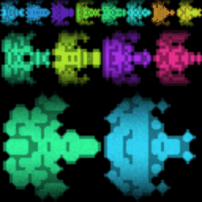

## ドット絵を自動生成する

ドット絵の自動ジェネレーターと呼ばれるものは色々あるが、よくあるパターンが、あらかじめ決められた多数のパーツを組み合わせ、色味を変えて新たなドット絵を作成するものだ [^1]。ゲームでのアバター作成などでもよく用いられる手法で、違和感の無い多数のキャラクタ、およびそのアニメーションを作ることができる。ただしこの方法ではある決まったキャラクタのバリエーションしか作れない。作りたいキャラクタに対応するジェネレーターが無いと、所望のドット絵は手に入らない。

もう少し柔軟性のある方法として、あるベースとなるドット絵に対して、ランダムに on/off となるドットを追加し、それらの変化で様々なパターンを作る方法がある [^2]。この方法だと、ベースのドット絵を変更することにより、様々なキャラクタの生成に対応できる。

私もこの方式に従ったドット絵作成ライブラリを作ってみた [^3]。例えば、このライブラリを作って様々な形の宇宙船を作ると、以下のようになる（画像クリックでデモページへ）。

この方式で出来上がるものはランダム性が高く、宇宙船などの造形が自由なキャラクタを得意としているが、目・腕・足などがきちんとある横から見たモンスター、などの制約があるキャラクタは不得意だ。このようにドット絵のジェネレーターは得手不得手がどうしてもあり、万能なものは無い。

最近は生成系 AI により、プロンプトに基づく絵の生成ができるようになり、これをドット絵に応用する方法も出てきている [^4]。ただし、生成系 AI はどちらかというと大きな一枚絵を作成することを得意としており、16x16 ドットなどの限られた小さな絵を作成することには、あまり向いていない。

しかし、今後の技術の発展により、ドット絵のような小さな絵の生成や、そのアニメーションの生成が可能になるかもしれない。例えば、DALL-E 3 モデルを搭載した Bing Image Creator [^5] に下記のプロンプトを与えることで、シューティングゲームでも利用可能な、宇宙船のドット絵を得ることができる。

> Create an image showcasing a collection of retro video game-style spaceships, viewed from above. Each spaceship should be designed within a 32x32 pixel grid, utilizing a 16-color palette. Arrange multiple of these pixelated spaceships in a visually appealing manner.

プロンプトの指示にある 32x32 ドットの絵を作成するという制約は、まだ正しく守られていない。しかし、このような問題は、今後の生成モデルの発展により徐々に解決されていくだろう。

---

[^1]: [pixeldudesmaker](https://0x72.itch.io/pixeldudesmaker)
[^2]: [Pixel Spaceships](http://web.archive.org/web/20080228054410/http://www.davebollinger.com/works/pixelspaceships/)
[^3]: [pixel-art-gen](https://github.com/abagames/pixel-art-gen)
[^4]: [5 Best AI Pixel Art Generators in 2023](https://mspoweruser.com/ai-pixel-art-generator/)
[^5]: [Bing Image Creator](https://www.bing.com/create)
